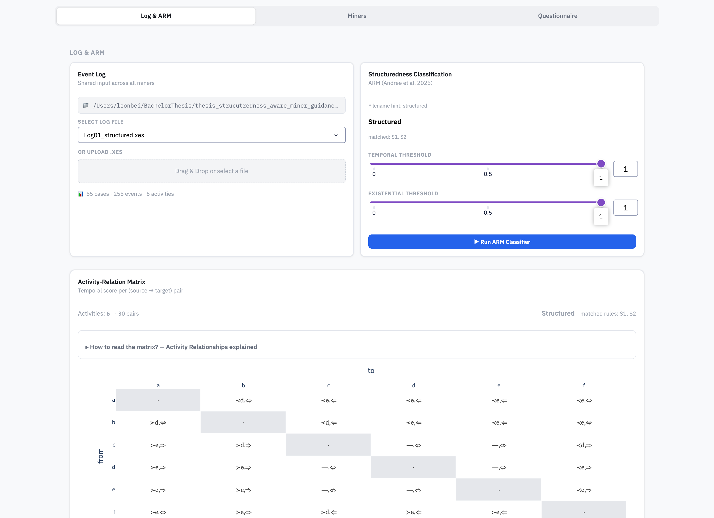
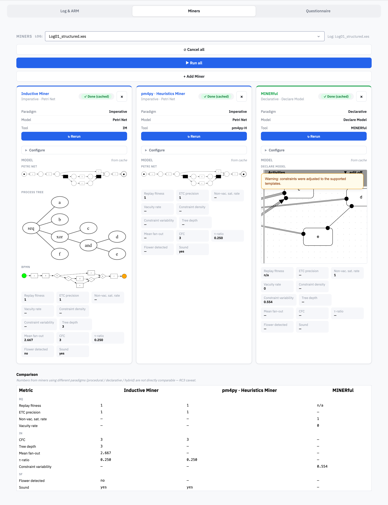
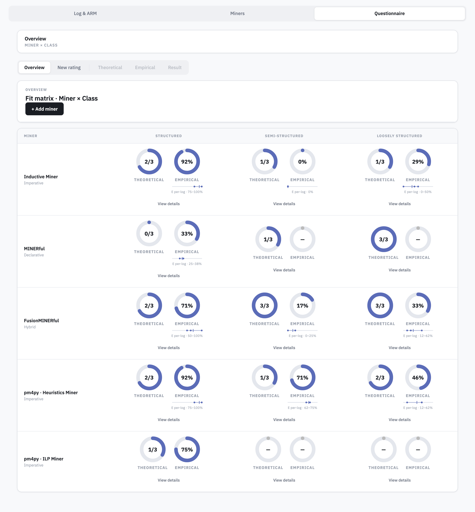
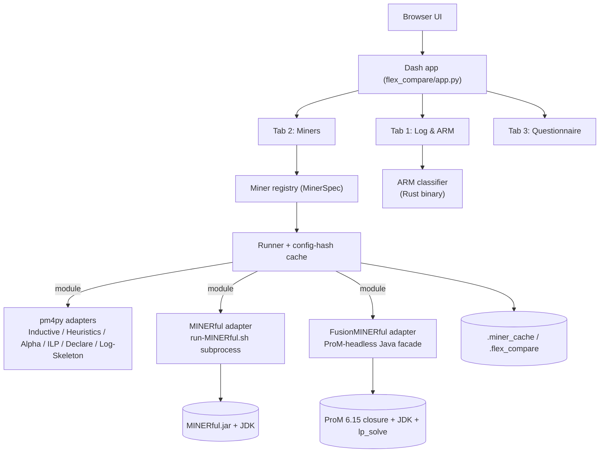

# Prototype Tool - Structuredness-Aware Miner Guidance

> Structuredness-aware process-discovery workbench.
> Pick an event log, classify how structured its behaviour is, run several discovery
> miners on it with their own configurations, compare the resulting models, and score
> each miner against a structuredness class with a two-phase questionnaire.

This prototype tool is the software artifact of the bachelor thesis *"Structuredness-Aware
Guidance for Process Discovery Miner Selection."* It is a standalone web application:
you start it locally and use it in the browser.

---

## 1. Goal and task

**The problem.** Process discovery turns an *event log* (a recording of what actually
happened in a process) into a *process model*. The program that does this is a *miner*.
Many miners exist and they disagree: on the same log, one draws a tidy flowchart,
another a permissive web of rules, a third an over-detailed tangle. No miner is best
everywhere, and a practitioner facing a new log has little guidance on which one to
reach for.

**The idea.** This thesis proposes using how *structured* the behaviour in a log is as a
prior for choosing a miner. A rigid process where every case follows nearly the same
path calls for a different miner than a flexible process where cases vary widely. Flex
Compare is the tool that lets you walk that argument on a real log: classify it, run
miners on it, and judge the results.

**Three small vocabularies** run through the whole tool:

- **Structuredness classes** — every log is sorted into exactly one of `structured`
  (rigid, repetitive), `semi-structured` (rigid fragments plus flexible regions), or
  `loosely-structured` (highly variable). Produced by the classifier in Tab 1.
- **Paradigms** — miners come in three styles: *imperative* miners draw an explicit
  flowchart of allowed paths (for example the Inductive Miner), *declarative* miners
  list constraints every valid run must respect (for example MINERful), and *hybrid*
  miners combine both (FusionMINERful).
- **Two scores** — when you judge a miner against a class, the tool records a
  *theoretical* score (what the miner is designed to do, read from its paper and docs)
  and an *empirical* score (what it actually produced on the logs you ran).

In one sentence each, the tool lets you: **understand** a log (classify its
structuredness and see why), **discover** models (run miners and compare them), and
**judge** miners (score each against a structuredness class).

---

## 2. The three tabs

The application has three tabs arranged left to right in the order an analyst works:
first understand the log, then run miners on it, then score those miners.

### Tab 1 — Log & ARM: understand the log

Choose a log: upload your own XES file or pick one from the bundled corpus under
`data/with-case-ids/`. Pressing *Run ARM Classifier* hands the log to the classifier and
fills the tab with three things:

- an **activity relationships matrix** (a heatmap where each cell describes how one pair
  of activities relates across the log, for example whether one always follows the
  other, whether they exclude each other, or whether they run in parallel),
- a **classification badge** stating the verdict in plain words (`structured`,
  `semi-structured`, or `loosely-structured`) together with the rules that fired,
- an **explainer** that decomposes the verdict so it is never a black box: you can trace
  it back to the specific relations in the log that caused it.

By the end of Tab 1 you know which class your log belongs to. That class is the thread
you carry into the next two tabs.


> _Screenshot placeholder: Tab 1 with the activity relationships matrix and the
> classification badge._

### Tab 2 — Miners: discover and compare models

Pressing *+ Add Miner* drops a **miner card** onto the page. Each card lets you pick a
miner and shows a configuration form tailored to it. You can add as many cards as you
like, including several copies of the same miner with different settings, to compare
configurations against each other.

The miners available out of the box, grouped by paradigm, are:

- **imperative:** Inductive Miner, plus the pm4py family (Heuristics, Alpha, Alpha+, ILP,
  Genetic),
- **declarative:** MINERful, plus pm4py's Declare and Log-Skeleton miners,
- **hybrid:** FusionMINERful.

Pressing *Run* on one card, or *Run all* across every card, discovers the models. Each
card then shows a rendered picture of its model plus a row of **quality indicators**
(fitness, precision, soundness, and paradigm-appropriate structural measures). At the
bottom, a **comparison strip** lays every finished model next to the others so the
differences are visible at a glance.


> _Screenshot placeholder: Tab 2 with two miner cards and the comparison strip._

### Tab 3 — Questionnaire: score a miner against a class

Tab 3 turns the observations from Tabs 1 and 2 into a judged score. It is a guided
questionnaire filled in for one miner and one structuredness class at a time.

The tab opens on an **Overview**, a **miner-by-class matrix**: one miner per row, one
column for each of `structured`, `semi-structured`, and `loosely-structured`, and a
small pair of donuts in each cell showing that miner's theoretical and empirical fit for
that class. The two fits are kept **separate and never combined**: the theoretical fit is
reported as a fraction of the theoretical items answered yes (for example `2/3`), and the
empirical fit as a percentage. An *+ Add miner* button starts a fresh rating that
proceeds through two phases:

- the **Theoretical** phase asks, item by item, what the miner is *designed* to do; each
  item is answered yes / no / not-applicable, with the miner's paper, documentation, and
  source as the intended evidence,
- the **Empirical** phase scores what the miner *actually produced*, rating the
  discovered model on **three sample logs of the relevant structuredness class** on a
  0 / 1 / 2 scale.

The **Result** view puts the two phases side by side as a theoretical donut (`#Yes / #items`)
and an empirical donut (percentage), without merging them into a single score, each broken
down across three **dimensions**: **BQ** (behavioural quality), **IN** (interpretability),
and **SF** (structural fit).

Note the two different axes. The Overview matrix ranges over the three structuredness
*classes*; the BQ / IN / SF breakdown in the Result view ranges over the three quality
*dimensions* of a single score. They are not the same thing.

Everything you enter is written to disk, per miner, per class, and per item, so a rating
survives a restart. The tool records and aggregates your structured judgement; it does
not decide the miner choice for you.


> _Tab 3 Overview matrix: each cell carries a separate theoretical donut (`#Yes / #items`)
> and empirical donut (percentage), with the per-log empirical spread below the empirical ring._

---

## 3. Technical implementation

The tool is a thin, data-driven [Dash](https://dash.plotly.com/) front end over a
set of vendored upstream miners, with a single registry, a content-addressed cache, and
a dispatch layer. The entry point is `flex_compare/app.py`.

**Registry.** `miner_registry.MinerSpec` is the only place a miner is declared. Each
entry carries `id`, `label`, `paradigm`, `anchor_class`, `entry_point`, `config_schema`,
and `runner_kind` (`module` for Python entry points, `executable` for external
binaries). The configuration form, the paradigm grouping, and the dispatch route all
follow from a single entry automatically.

**Cache and reproducibility.** Runs are cached deterministically.
`stable_config_hash(config)` is `sha1(json.dumps(config, sort_keys=True))[:8]`, stable
across processes and restarts. A run is keyed on the log, the miner type, and that
configuration hash, so removing a configured miner and adding it back with the same
settings is an instant cache hit instead of a recomputation.

### How each miner is integrated

| Miner | Paradigm | Integration | Invocation |
|---|---|---|---|
| Inductive Miner (+ pm4py family: Heuristics, Alpha, Alpha+, ILP, Genetic) | imperative | Python library | `pm4py.discover_*` in `internal/imperative_miner/` and `internal/pm4py_miner/evaluation.py` |
| MINERful | declarative | subprocess to a JAR | `tools/MINERful/run-MINERful.sh -iLF … -oJSON …` via `internal/declarative_miner/evaluation.py` |
| MINERful fitness checker (conformance) | declarative | JVM subprocess | `minerful.MinerFulFitnessCheckStarter` from `MINERful.jar`, via `internal/declarative_evaluation/minerful_fitness.py` |
| pm4py Declare / Log-Skeleton | declarative | Python library | `pm4py.discover_declare` / `pm4py.discover_log_skeleton` |
| FusionMINERful | hybrid | ProM-headless + a custom Java facade | `java -cp <ProM closure> thesis.fusion.HeadlessFusionMinerFulRunner`, compiled and dispatched in `internal/fusion_miner/{runtime,evaluation}.py` |
| ARM classifier | classification | Rust binary subprocess | `tools/automated-process-classification/target/release/matrix_classifier` via `internal/shared/arm_runner.py` |

### Architecture overview



### How to add a miner

The tool is built to be extended, so you can grow the set of available algorithms:

- **A built-in miner** is a single `MinerSpec` entry in the registry. The form, the
  paradigm grouping, and the dispatch route are derived from it, so no other code has to
  change.
- **An external miner** needs no code change at all. The **`custom-module`** path points
  the tool at any Python function with the signature `(log_path, output_root, run_id, …)`.
  The **`custom-exec`** path points it at any binary or script that writes a model file
  in one of three standard formats: **PNML** (replayed with pm4py), **MINERful-native
  Declare-JSON**, or **BPMN** (converted to PNML and then treated the same way).

---

## 4. Dependencies

### Python packages

Declared in [`pyproject.toml`](pyproject.toml) / [`requirements.txt`](requirements.txt).

| Package | Role | Source |
|---|---|---|
| dash ≥ 3.0 | web UI framework (needs React 18) | <https://dash.plotly.com/> |
| plotly ≥ 5.20 | charts and visualisations | <https://plotly.com/python/> |
| pm4py ≥ 2.7 | Inductive Miner, pm4py miners, conformance checking | <https://pm4py.fit.fraunhofer.de/> · [github](https://github.com/pm4py/pm4py-core) |
| pandas ≥ 2.0 | data handling | <https://pandas.pydata.org/> |
| numpy ≥ 1.26 | numerics | <https://numpy.org/> |
| lxml ≥ 5.0 | XES/XML parsing | <https://lxml.de/> |
| PyYAML ≥ 6.0 | questionnaire config parsing | <https://pyyaml.org/> |
| openpyxl ≥ 3.1 *(optional)* | Excel export of metric aggregates | <https://openpyxl.readthedocs.io/> |
| playwright ≥ 1.40 *(optional)* | PNG snapshots of declare-js models | <https://playwright.dev/python/> |
| pytest, pytest-cov *(dev)* | test suite | <https://pytest.org/> |

Optional groups install via `pip install -e .[artifacts]` and `pip install -e .[dev]`.

### External code and binaries

These are vendored under `tools/` and `flex_compare/internal/` and carry their own
upstream licenses (see [`LICENSE`](LICENSE)).

| Component | Used for | Source |
|---|---|---|
| ARM classifier (`automated-process-classification`, Rust; Andree et al. 2025) | structuredness classification in Tab 1 | <https://github.com/INSM-TUM/automated-process-classification> · [demo](https://insm-tum.github.io/automated-process-classification/) |
| MINERful (Di Ciccio et al.; "MINERful-Reloaded", Iacometta & Di Ciccio 2025) | declarative discovery + fitness checker | <https://github.com/Process-in-Chains/MINERful> · [paper](https://ceur-ws.org/Vol-4032/paper-43.pdf) |
| ProM Framework 6.15 + plugins | runtime host for the FusionMINERful/DeclareMINERful plugins | <https://promtools.org/> · [packages](https://www.promtools.org/prom6/packages615/) |
| FusionMINERful / DeclareMINERful | hybrid discovery, implemented as ProM plugins and run headless through the ProM closure; root packages pinned in `internal/fusion_miner/prom-lock.json` | via ProM — <https://promtools.org/> · [packages](https://www.promtools.org/prom6/packages615/) |
| declare-js (`internal/declarative_miner/assets/declare-js.min.js`; Nagel, Amann & Delfmann 2023) | in-browser rendering of Declare constraint models | [gitlab.uni-koblenz.de](https://gitlab.uni-koblenz.de/process-science/research/declare-js) · [paper](https://ceur-ws.org/Vol-3648/paper_9628.pdf) |
| lp_solve 5.5 (JNI native lib) | linear-programming solver required by ProM/FusionMINERful | <https://lpsolve.sourceforge.net/> |
| OpenJDK 11 | JVM for the MINERful and ProM subprocesses | <https://openjdk.org/> (Homebrew `openjdk@11`) |

---

## 5. Setup and run

### Requirements

- **Python ≥ 3.11**
- a working **JDK 11** (for the Java miners MINERful and FusionMINERful)
- the Rust toolchain only if you want to recompile the ARM binary (a pre-built binary is
  bundled)

### Install and run

```bash
cd questionnaire_prototype
python -m venv .venv && source .venv/bin/activate
pip install -e .[dev]

python -m flex_compare.app        # http://127.0.0.1:8502
# or: miner-guidance
```

Then open <http://127.0.0.1:8502> and follow the three tabs in order: classify the log
in Tab 1, discover and compare models in Tab 2, score a miner against a class in Tab 3.

### Useful environment variables

| Variable | Default | Effect |
|---|---|---|
| `DASH_PORT` | `8502` | HTTP port |
| `DASH_HOST` | `127.0.0.1` | bind address |
| `DASH_DEBUG` | unset | enable Dash debug mode (auto-reload) |
| `FLEX_PROJECT_ROOT` | repo root | override where `tools/`, `.miner_cache/`, `.flex_compare/` live |
| `FLEX_RUN_CONCURRENCY` | `3` | max simultaneous miner runs from *Run all* |
| `FLEX_COMPARE_LOG_LEVEL` | `INFO` | Python logging level |

### Platform note (macOS-arm64 binaries)

Two checked-in native binaries are built for **macOS-arm64** and must be rebuilt on other
platforms:

- `tools/automated-process-classification/target/release/matrix_classifier` (ARM
  classifier, Rust),
- `flex_compare/internal/fusion_miner/java/native/lpsolve-macos-arm64/liblpsolve55j.jnilib`
  (lp_solve native lib for FusionMINERful).

The ProM package closure is pinned by
`flex_compare/internal/fusion_miner/prom-lock.json`. If you need to re-hydrate it offline,
run `python -m flex_compare.internal.fusion_miner.runtime --download-archives`. See
[`SETUP.md`](SETUP.md) for the full platform details.

---

## License

MIT (see [`LICENSE`](LICENSE)). Bundled native binaries carry their own upstream licenses,
also documented in `LICENSE`.
